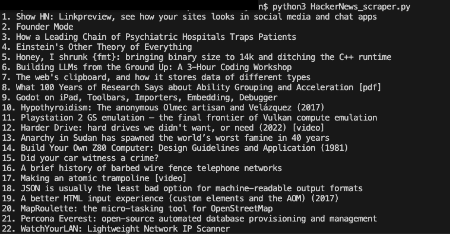

# HackerNews-Headline-Scraper

This Python script scrapes the latest headlines from the Hacker News front page using the `requests` and `BeautifulSoup` libraries.

## Features
- Fetches the most recent headlines from Hacker News.
- Simple and easy to customize for other websites.

## Requirements
- Python 3.x
- `requests` library
- `beautifulsoup4` library

## Installation
1. Clone this repository:
    ```bash
    git clone https://github.com/your-github-username/HackerNews-Headline-Scraper.git
    ```
2. Navigate to the directory:
    ```bash
    cd HackerNews-Headline-Scraper
    ```
3. Install the required dependencies:
    ```bash
    pip install -r requirements.txt
    ```

## Usage
Run the script:
```bash
python scrape_headlines.py
```

## Example Output

